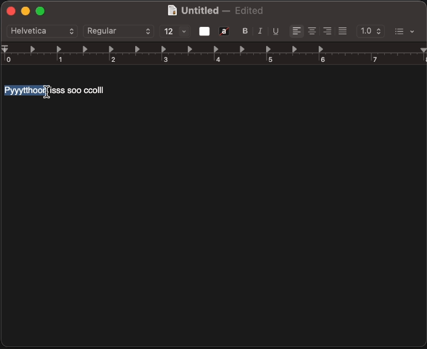

# AI-powered typing assistant

## Get Started
Before you run the application, you'd need Ollama installed on your local machine.
```
$ brew install ollama
```

After Ollama is installed, you need to have daemon running:
```
$ ollama serve
```

Download models you'd like to use, e.g. Mistral 7B quantized model
```
$ ollama run mistral:7b-instruct-v0.2-q4_K_S
```

Run the application by 
```
$ python3 typing-assistant/app.py
```

Note: currently only supports MacOS. tested on Macbook Air M2 model.

### Demo
<p align="center">
    
</p>

## Support 
- [ ] Ollama model auto-download
- [ ] OS support: Windows
- [ ] custom hotkey configurable on the terminal itself
